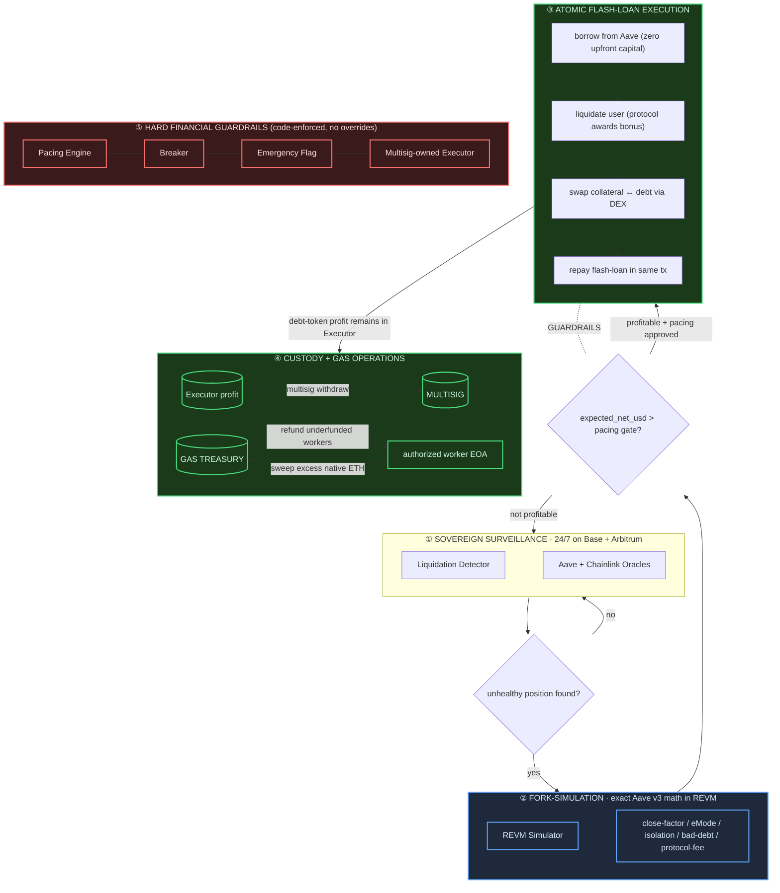

# Project Chimera - Sovereign L2 MEV + AI Audit System

**Status**: Standalone-Executor liquidation engine implemented; shadow-first and never auto-flips to live.

> Validation gate: the core remediation has NOT been validated end-to-end in this environment — `cargo` and `forge` have not been run here and MUST be verified on a developer workstation with the full toolchain before any output is trusted. The toolchains (`cargo`, `forge`, `slither`) are not installed in every environment. Run the commands in [Build & Test](#build--test) on a machine with the Rust toolchain, Foundry, and Slither before trusting any simulation output. A 7-day shadow soak is required before any shadow-to-live transition, and live mode additionally requires an encrypted keystore and a multisig-owned deployment. Live execution remains gated until the full validation gate in `.kilo/plans/comprehensive-refactor-validation-security-research.md` passes.

---

## Documentation Index

All documentation files in the repository, with brief descriptions:

| Document | Description |
|----------|-------------|
| [docs/architecture.md](docs/architecture.md) | Component diagram, data flow, trait boundaries, deployment topology |
| [docs/threat-model.md](docs/threat-model.md) | Threat model and attack surface analysis |
| [docs/snapshot-schema.md](docs/snapshot-schema.md) | `ReserveData` struct schema — must stay in sync with `core/src/simulator/prewarm.rs` |
| [docs/first-run-onboarding.md](docs/first-run-onboarding.md) | Click-by-click beginner guide grounded in recursive code analysis |
| [docs/operator-manual.md](docs/operator-manual.md) | Deploy, config tuning, emergency pause, log triage, EOA rotation |
| [docs/deployment-checklist.md](docs/deployment-checklist.md) | Pre-deployment checklist for shadow and live modes |
| [docs/emergency-procedures.md](docs/emergency-procedures.md) | Incident response playbook |
| [docs/incident-log.md](docs/incident-log.md) | Incident tracking template (new in 0.1.4) |
| [docs/runbook-7day-soak.md](docs/runbook-7day-soak.md) | 7-day shadow-soak runbook |
| [docs/runbook-keystore-multisig-go-live.md](docs/runbook-keystore-multisig-go-live.md) | Keystore and multisig go-live runbook |
| [docs/runbook-testnet-deploy.md](docs/runbook-testnet-deploy.md) | Testnet deployment runbook |
| [docs/runbook-wallet-provisioning.md](docs/runbook-wallet-provisioning.md) | Testnet wallet provisioning runbook |
| [docs/testing-strategy-liquidations.md](docs/testing-strategy-liquidations.md) | Test pyramid: unit, integration, proptest, golden replay, Foundry fork tests |
| [docs/security-research.md](docs/security-research.md) | CVE/advisory workflow and curated Aave/Solidity/Slither references |
| [docs/research/aave-v3-liquidation-compendium.md](docs/research/aave-v3-liquidation-compendium.md) | Aave V3 liquidation logic source map and regression scenarios |
| [docs/research/dependency-cve-triage.md](docs/research/dependency-cve-triage.md) | CVE triage for pinned dependencies |
| [docs/gate-report-2026-06-16.md](docs/gate-report-2026-06-16.md) | Validation gate run record |
| [docs/gate-report-2026-06-16-t2.md](docs/gate-report-2026-06-16-t2.md) | Validation gate run record (t2) |
| [docs/monetization.md](docs/monetization.md) | Lawful revenue paths, rejected approaches, compliance checklist (new in 0.2.0) |
| [docs/release-readiness.md](docs/release-readiness.md) | v0.2.0 first-release readiness plan and gap register (new in 0.2.0) |
| [CONTRIBUTING.md](CONTRIBUTING.md) | Development setup and validation gate instructions (new in 0.1.4) |
| [SECURITY.md](SECURITY.md) | Vulnerability reporting and security model (new in 0.1.4) |
| [CHANGELOG.md](CHANGELOG.md) | Release history in Keep a Changelog format |

Note: `PHASE6_VALIDATION_GATE.md` was revoked during the Wave 0 re-audit and
removed; current gate status lives in [docs/release-readiness.md](docs/release-readiness.md).

The `ai-audit/` directory is optional/auxiliary — it contains Slither + local Ollama contract scanning tooling that is independent of the engine and not part of the liquidation funds path.

---

## How It Earns

Chimera is a sovereign liquidation engine running on L2s (Base, Arbitrum). It exists to capture one specific on-chain inefficiency: Aave V3 pays liquidators a bonus spread when they close underwater positions. The protocol hands that bonus to whoever does the work. Chimera submits permissionless liquidations, while operators remain responsible for monitoring, emergency actions, gas operations, and multisig withdrawals of Executor-held profit. Current transactions use the configured standard RPC; private/protected submission is not wired.

The revenue loop is atomic and capital-light:

1. **Surveillance** — the detector scans Aave V3 pools across Base and Arbitrum every scan cycle, looking for user positions whose Health Factor has dropped below 1.0. It filters out frozen, paused, and inactive reserves, detects bad-debt positions it must not touch, and applies Aave V3's eMode / isolation-mode / siloed-borrowing rules correctly — all of it enforced at the candidate-selection layer, not after a wasted flash-loan attempt.

2. **Fork simulation** — every candidate is replayed inside a REVM fork of the exact chain, using Aave V3's own math. The simulator reads the real Aave config bitmap (close-factor, eMode LT/bonus override, liquidation protocol fee, isolation debt ceiling, siloed flags) and computes the net yield after the protocol takes its cut and after the DEX slippage is honored. If the simulation does not clear a 2.5x profit-over-gas hurdle, the candidate is discarded. No broadcast.

3. **Atomic flash-loan execution** — an authorized worker signs an ordinary EIP-1559 transaction to the configured standalone Executor's `execute(bytes)` entrypoint. There is no EIP-7702 or delegation path. Executor calls the configured Aave Pool's `flashLoanSimple` with itself as receiver, validates that the callback caller is that Pool and the initiator is Executor, liquidates the user, swaps collateral back to debt, and repays atomically. If any step fails, the transaction reverts. Aave supplies the liquidation capital; operator funds cover gas only.

4. **Sovereign custody** — successful debt-token profit remains in Executor. The multisig owner consolidates it with `withdraw(token, amount)`. Worker EOAs normally retain only gas ETH. The Rust `SweepScheduler` sweeps excess native worker ETH to the treasury signer and refunds underfunded workers; it does not sweep ERC20s, and `sweep_tokens` is currently unused.

5. **Guardrails that cannot be bypassed** — the pacing engine enforces $2,000 net daily, $7,500 net weekly, $1,000 per liquidation, 6–18h jitter between ops, auto-halt on 3 consecutive reverts, auto-halt on >300 gwei gas, auto-halt on 0.005 ETH daily loss. `emergency_pause.py` trips the breaker; `clear_breaker` requires `CHIMERA_OPERATOR_TOKEN`. Executor ownership is fixed at construction to the multisig. Only the owner or workers explicitly authorized with `setWorker(worker, true)` may call `execute(bytes)`; `setPool`, `setWorker`, `withdraw`, and `transferOwnership` remain owner-only. Live startup verifies deployed Executor bytecode, `pool()` equality, every active worker's `isWorker` status, treasury signer/address parity, EOA-pool/signer parity, and gas funding. `execute_mode` defaults to `shadow`, and `shadow-guard` refuses committed live config.

The engine runs in shadow mode for a mandatory 7-day soak before a live transition is permitted (enforced by `toggle_shadow.py` against `core/state/mode.json`). After all go-live checks pass, it can execute profitable opportunities and maintain worker gas automatically. Debt-token profit remains in Executor until the multisig withdraws it. Private/protected submission is not wired: current execution broadcasts raw transactions to the configured standard RPC, so protected submission is strongly recommended before real-money operation.

```mermaid
flowchart LR
    subgraph find["find: 24/7 Aave V3 surveillance"]
      D[detector] --> O[oracles: Aave + Chainlink]
    end
    find --> validate{"simulate: REVM fork\nexact Aave v3 math\neMode · isolation · bad-debt · protocol-fee"}
    validate -->|profitable \+ pacing OK| fire["fire: flash-loan → liquidate → swap → repay\n(all-or-nothing in one tx)"]
    validate -->|not profitable| find
    fire --> P[(debt-token profit in Executor)]
    P -->|multisig withdraw(token, amount)| M[(multisig custody)]
    T[(gas treasury signer)] -->|Rust refund scheduler| W[authorized worker EOAs]
    W -->|excess native ETH sweep| T
    W --> find
```

## Architecture Overview

Chimera is a sovereign liquidation MEV system built for L2s (Base, Arbitrum, Optimism). At its core it combines a Rust execution engine with Yul flash-loan contracts and hard financial guardrails. A `$50 seed` is only an illustrative native-gas reserve for worker transactions, not liquidation or trading capital; Aave flash loans supply the liquidation capital. A separate, optional `ai-audit/` tooling component (Slither + a local Ollama model) ships alongside it for experimental contract scanning; it is auxiliary and independent of the MEV engine, not part of the liquidation funds path.

The data flow is simple: the **Detector** spots unhealthy positions, the **Simulator** replays them in a forked REVM with exact Aave v3 math, the **Pacing Engine** governs whether execution is financially safe, and an authorized worker signs an EIP-1559 call to the standalone **Executor**.



---

## Directory Structure

```
project-chimera/
├── core/              # Rust engine (REVM + Aave math + pacing)
│   ├── src/
│   │   ├── config.rs
│   │   ├── detector/
│   │   ├── error.rs
│   │   ├── executor/
│   │   ├── lib.rs
│   │   ├── main.rs
│   │   ├── metrics.rs
│   │   ├── oracle/
│   │   ├── pacing_engine.rs
│   │   ├── simulator/
│   │   └── state/
├── config/           # YAML/TOML configs (pacing, risk, routing, pools, EOA pool)
├── contracts/        # Yul Executor + Solidity interfaces + Foundry tests
├── ai-audit/         # OPTIONAL auxiliary tooling: Slither + local Ollama contract scanner (independent of the engine)
├── scripts/          # Python utilities (snapshot, rotation, venues, emergency)
├── tests/fixtures/   # Golden replay data
└── docs/             # Architecture, operator manual, emergency procedures, schemas, security research
```

---

## Quick Start (Windows 11 + WSL2)

### Prerequisites

- Rust (latest stable)
- Foundry (`forge`, `cast`, `anvil`)
- Python 3.11+

### Build & Validate

```bash
# Build the core engine
cargo build -p chimera-core --release

# Run contract tests
cd contracts/
forge test

# Generate a mock snapshot for testing
cd ..
python scripts/snapshot_generator.py --chain base --mock
```

---

## Core Modules

| Module | Description |
|--------|-------------|
| **Pacing Engine** | Financial governor. Enforces daily/weekly caps, jitter windows, profit multipliers, and auto-halt triggers. |
| **Liquidation Detector** | Fast health-factor pre-filter. Scans Aave v3 pools for positions eligible for liquidation. |
| **REVM Simulator** | High-fidelity fork simulation. Replays liquidations with exact Aave v3 math, eMode, isolation mode, and bad-debt coverage. |
| **Price Oracle** | Chainlink primary with Aave fallback. Aggregates prices for simulator and detector. |
| **Transaction Executor** | Builds `execute(bytes)`, signs ordinary EIP-1559 transactions with authorized worker keystores, and broadcasts raw transactions to the configured standard RPC. |
| **State Persistence** | JSONL audit trail + crash recovery. Logs every decision, simulation, and execution for post-hoc analysis. |
| **Atomic Executor** | Standalone, multisig-owned Yul contract. Self-initiates Aave flash loans, validates callback caller/initiator, retains token profit, and exposes owner-only withdrawals. |

### Auxiliary tooling (not a core capability)

The `ai-audit/` directory is an **optional, experimental, best-effort** contract-scanning pipeline that is fully separate from the liquidation engine and the funds path. When run manually (`ai-audit/scripts/run_audit.py`), it monitors L2 contract-creation events, runs Slither plus a local Ollama LLM over fetched/verified sources, and emits draft bounty-report JSON into `ai-audit/queue/`. It requires Slither and a local Ollama model to be installed, has a stubbed bytecode-fetch fallback (so it degrades gracefully when no verified source is available), and is not required for — nor connected to — shadow- or live-mode operation of the MEV engine.

Key supporting documents:

- `docs/security-research.md` — CVE/advisory workflow and curated Aave/Solidity/Slither references.
- `docs/research/aave-v3-liquidation-compendium.md` — Aave V3 liquidation logic source map and regression scenarios.
- `docs/snapshot-schema.md` — JSON contract between `scripts/snapshot_generator.py` and Rust prewarming.

---

## Financial Guardrails

All guardrails are hard-coded in `core/src/pacing_engine.rs` and enforced at runtime.

- **$2,000** daily net cap
- **$7,500** weekly net cap
- **$1,000** single transfer max
- **6–18h** randomized jitter between transfers
- **2.5x** profit multiplier after ALL gas + L1 fees
- **Auto-halt** on 3+ reverts, gas >300 gwei, or 0.005 ETH daily loss

---

## Operator Checklist (10–20 min daily)

1. Open **Grafana** (`localhost:3002`) → confirm no breaker trips, inclusion >85%.  <!-- NOTE: The default Grafana port (localhost:3000) must be changed to avoid conflicts with existing Docker stacks using ports 3000/3001. -->
2. Review `cargo run` or binary logs for pacing decisions.
3. Update `config/pools.toml` weekly (manual for v1).
4. Run `python scripts/update_venues.py` weekly.
5. (Optional) If you run the auxiliary `ai-audit/` scanner, review `ai-audit/queue/` for new draft reports. This is independent of the engine and not part of daily liquidation operations.

---

## Never (enforced in code + process)

- Override simulation checks or pacing.
- Disable breakers.
- Reuse clean wallets without rotation.
- Exceed daily/weekly caps.
- Run >72h unmonitored without active breakers + alerts.

---

## Development Status

The project has undergone a security + wiring remediation pass across five waves. This reflects code that has been written and self-reviewed — **not** an independent audit, and **not** a full toolchain validation in this environment.

**Done in the remediation pass (Waves 1–5):**

- **Contracts hardened** — standalone `Executor.yul` uses construction-time multisig ownership, explicit worker authorization, pool/caller/initiator validation, an owner withdrawal path, and overflow guards, with corresponding Foundry tests in `contracts/test/`. Foundry targets Cancun.
- **Runtime wired** — real snapshot loader, simulator, and oracles connected; signer loaded from keystore; `RpcSubmitter` with a `dry_run` path; JSONL persistence; a mode-transition gate; and file logging.
- **Safety surface connected** — `emergency.flag` reader, breaker metric, daily/weekly USD gauges, and Grafana/Alertmanager wiring.
- **Operator tooling** — the Python helper scripts under `scripts/` completed (see [Operator Tooling](#operator-tooling)).
- **Security hardening (Wave 5)** — Foundry coverage includes construction ownership, worker authorization, `transferOwnership`, callback validation, and no lazy initialization; `contracts/script/Deploy.s.sol` enforces multisig-owned deployment; Aave V3 edge cases are implemented end-to-end; CI includes dependency/static-analysis gates plus `shadow-guard` blocking committed live config.

**Honest remaining gaps (must be closed before any live transition):**

- Full toolchain validation (`cargo test`, `forge test`) has **NOT** been run in the remediation environment and must be verified on a developer workstation.
- A **7-day shadow soak** is required before any shadow-to-live transition.
- Live mode requires an **encrypted keystore** and a **multisig-owned deployment**.
- Private/protected transaction submission is **not wired**; live calls currently use the configured standard RPC.

The engine remains **shadow-mode-first and never auto-flips to live**. The shadow-to-live transition is gated in code and additionally subject to the operator preconditions above.

---

## Operator Tooling

The `scripts/` directory holds the Python operational helpers. All scripts import cleanly without `web3.py` installed (AGENTS.md invariant #5).

- **Rust `SweepScheduler`** — primary automated gas path: sweeps excess native worker ETH to the treasury signer and refunds underfunded workers. It does not sweep ERC20s; `sweep_tokens` is currently unused.
- **`fund_eoa.py`** — legacy/manual worker gas-funding helper. Primary runtime top-ups use the Rust scheduler and encrypted `SignerRegistry` keystores.
- **`sweep_profits.py`** — implemented legacy/manual raw-key-file helper for worker balances. It is not the Executor-profit path and is not the scheduled primary workflow; consolidate Executor token profit through multisig `withdraw(token, amount)`.
- **`emergency_pause.py`** — writes the circuit-breaker flag read by the Rust binary at sub-interval polls (≤3s detection).
- **`check_balances.py`** — health-checks wallet balances (native + ERC20), exits non-zero if any worker is below min threshold.
- **`health_check.py`** — end-to-end preflight: RPC reachable, metrics alive, mode.json parse, snapshot freshness.
- **`dry_run.py`** — validates config + RPC in shadow mode, optionally boots the binary for N seconds.
- **`toggle_shadow.py`** — manages `core/state/mode.json` (the Rust binary reads this at startup); enforces the 7-day shadow soak before permitting `--set-live`.
- **`recover_state.py`** — rebuilds aggregated pacing state from `core/state/outcomes.jsonl`, mirroring the Rust `CrashRecovery`.
- **`rotate_eoa.py`** / **`rotate_wallet.py`** — round-robin wallet rotation with cooldown; `rotate_wallet.py` is a docs-compatible alias.
- **`snapshot_generator.py`** — emits Aave V3 pool snapshots (live RPC or `--mock`).
- **`update_venues.py`** — discovers DEX liquidity across Aerodrome/Uniswap V3/Sushi/Camelot.
- **`status.py`** — read-only dashboard.
- **`fetch_historical_liquidations.py`** — pulls historical LiquidationCall events for soak comparison.

---

## Build & Test

Prerequisites: Rust (stable) + `cargo`, Foundry (`forge`), Python 3.11+, and (optional) `slither`.
The repo is a Cargo workspace; run `cargo` commands from the repo root.

```bash
# Rust unit + integration tests (workspace root)
cargo test -p chimera-core

# Solidity contract tests (requires forge-std: `forge install foundry-rs/forge-std` in contracts/)
forge test --root contracts/

# Python script syntax check
python -m compileall scripts ai-audit/scripts

# Static analysis (optional)
slither contracts --config-file slither.config.json

# Dependency CVE triage (optional) — see docs/research/dependency-cve-triage.md
cargo audit && pip-audit && osv-scanner -r .
```

---

## License

Proprietary — all rights reserved. See [LICENSE](LICENSE). Not for public
distribution. (Versions up to 0.1.4 were distributed under the MIT license;
the license changed at 0.2.0 — see CHANGELOG.)
