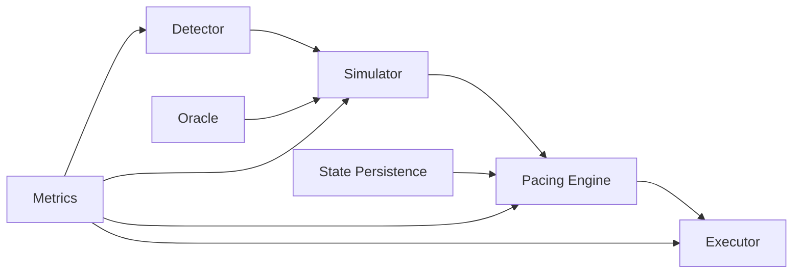

# Project Chimera - Sovereign L2 MEV + AI Audit System

**Status**: Phase 1 Complete — all core modules implemented; shadow-mode only.

> Validation gate: the toolchains (`cargo`, `forge`, `slither`) are not installed in every environment. Run the commands in [Build & Test](#build--test) on a machine with the Rust toolchain, Foundry, and Slither before trusting any simulation output or changing `execute_mode` to `live`. Live execution remains gated until the full validation gate in `.kilo/plans/comprehensive-refactor-validation-security-research.md` passes.

---

## Architecture Overview

Chimera is a sovereign liquidation MEV system built for L2s (Base, Arbitrum, Optimism). It combines a Rust execution engine with Yul contracts, a Python AI audit pipeline, and hard financial guardrails to operate safely from a $50 seed to a $50k/mo ceiling.

The data flow is simple: the **Detector** spots unhealthy positions, the **Simulator** replays them in a forked REVM with exact Aave v3 math, the **Pacing Engine** governs whether execution is financially safe, and the **Executor** builds and submits calldata via flash-loan contracts.



---

## Directory Structure

```
project-chimera/
├── core/              # Rust engine (REVM + Aave math + pacing)
│   ├── src/
│   │   ├── config.rs
│   │   ├── detector/
│   │   ├── error.rs
│   │   ├── executor/
│   │   ├── lib.rs
│   │   ├── main.rs
│   │   ├── metrics.rs
│   │   ├── oracle/
│   │   ├── pacing_engine.rs
│   │   ├── simulator/
│   │   └── state/
├── config/           # YAML/TOML configs (pacing, risk, routing, pools, EOA pool)
├── contracts/        # Yul Executor + Solidity interfaces + Foundry tests
├── ai-audit/         # Python pipeline (Slither + Ollama) for bounty reports
├── scripts/          # Python utilities (snapshot, rotation, venues, emergency)
├── tests/fixtures/   # Golden replay data
└── docs/             # Architecture, operator manual, emergency procedures, schemas, security research
```

---

## Quick Start (Windows 11 + WSL2)

### Prerequisites

- Rust (latest stable)
- Foundry (`forge`, `cast`, `anvil`)
- Python 3.11+

### Build & Validate

```bash
# Build the core engine
cargo build -p chimera-core --release

# Run contract tests
cd contracts/
forge test

# Generate a mock snapshot for testing
cd ..
python scripts/snapshot_generator.py --chain base --mock
```

---

## Core Modules

| Module | Description |
|--------|-------------|
| **Pacing Engine** | Financial governor. Enforces daily/weekly caps, jitter windows, profit multipliers, and auto-halt triggers. |
| **Liquidation Detector** | Fast health-factor pre-filter. Scans Aave v3 pools for positions eligible for liquidation. |
| **REVM Simulator** | High-fidelity fork simulation. Replays liquidations with exact Aave v3 math, eMode, isolation mode, and bad-debt coverage. |
| **Price Oracle** | Chainlink primary with Aave fallback. Aggregates prices for simulator and detector. |
| **Transaction Executor** | Calldata builder + RPC submitter. Constructs and sends transactions via the Yul flash-loan contract. |
| **State Persistence** | JSONL audit trail + crash recovery. Logs every decision, simulation, and execution for post-hoc analysis. |
| **Atomic Executor** | Yul flash-loan contract. Executes liquidations atomically with collateral swap and profit sweep. |
| **AI Audit Pipeline** | Local-only security analysis. Runs Slither + Ollama to generate bounty-ready vulnerability reports. |

Key supporting documents:

- `docs/security-research.md` — CVE/advisory workflow and curated Aave/Solidity/Slither references.
- `docs/research/aave-v3-liquidation-compendium.md` — Aave V3 liquidation logic source map and regression scenarios.
- `docs/snapshot-schema.md` — JSON contract between `scripts/snapshot_generator.py` and Rust prewarming.

---

## Financial Guardrails

All guardrails are hard-coded in `core/src/pacing_engine.rs` and enforced at runtime.

- **$2,000** daily net cap
- **$7,500** weekly net cap
- **$1,000** single transfer max
- **6–18h** randomized jitter between transfers
- **2.5x** profit multiplier after ALL gas + L1 fees
- **Auto-halt** on 3+ reverts, gas >300 gwei, or 0.005 ETH daily loss

---

## Operator Checklist (10–20 min daily)

1. Open **Grafana** (`localhost:3002`) → confirm no breaker trips, inclusion >85%.  <!-- NOTE: The default Grafana port (localhost:3000) must be changed to avoid conflicts with existing Docker stacks using ports 3000/3001. -->
2. Review `cargo run` or binary logs for pacing decisions.
3. Update `config/pools.toml` weekly (manual for v1).
4. Run `python scripts/update_venues.py` weekly.
5. Review `ai-audit/queue/` for new bounty reports.

---

## Never (enforced in code + process)

- Override simulation checks or pacing.
- Disable breakers.
- Reuse clean wallets without rotation.
- Exceed daily/weekly caps.
- Run >72h unmonitored without active breakers + alerts.

---

## Development Status

| Phase | Status | Description |
|-------|--------|-------------|
| **Phase 0** | ✅ Complete | Skeleton + PACING_ENGINE |
| **Phase 1** | ✅ Complete | Oracle + Executor + State + AI Audit + Detector/Simulator refinements |
| **Phase 2** | 🔄 Next | Validation hardening + golden replays + live shadow mode |
| **Phase 3** | 📅 Future | Controlled live execution |

---

## Build & Test

Prerequisites: Rust (stable) + `cargo`, Foundry (`forge`), Python 3.11+, and (optional) `slither`.
The repo is a Cargo workspace; run `cargo` commands from the repo root.

```bash
# Rust unit + integration tests (workspace root)
cargo test -p chimera-core

# Solidity contract tests (requires forge-std: `forge install foundry-rs/forge-std` in contracts/)
forge test --root contracts/

# Python script syntax check
python -m compileall scripts ai-audit/scripts

# Static analysis (optional)
slither contracts --config-file slither.config.json

# Dependency CVE triage (optional) — see docs/research/dependency-cve-triage.md
cargo audit && pip-audit && osv-scanner -r .
```

---

## License

Private — not for public distribution.
