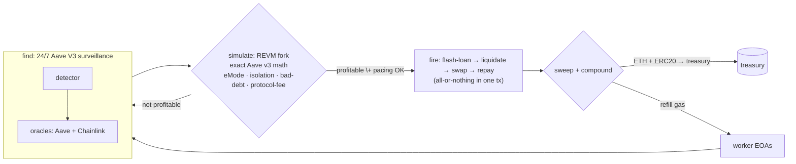
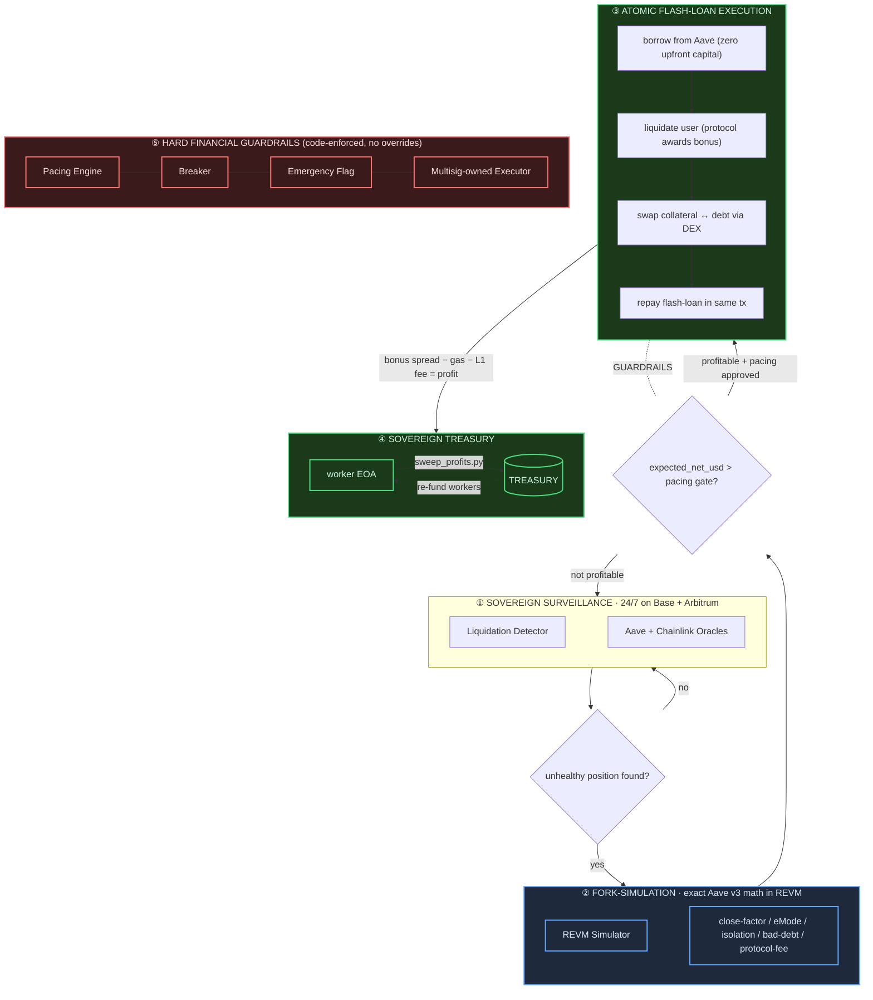

# Project Chimera - Sovereign L2 MEV + AI Audit System

**Status**: Sovereign autonomous liquidation engine — remediation pass (Waves 1–5) complete; shadow-mode only, never auto-flips to live.

> Validation gate: the core remediation has NOT been validated end-to-end in this environment — `cargo` and `forge` have not been run here and MUST be verified on a developer workstation with the full toolchain before any output is trusted. The toolchains (`cargo`, `forge`, `slither`) are not installed in every environment. Run the commands in [Build & Test](#build--test) on a machine with the Rust toolchain, Foundry, and Slither before trusting any simulation output. A 7-day shadow soak is required before any shadow-to-live transition, and live mode additionally requires an encrypted keystore and a multisig-owned deployment. Live execution remains gated until the full validation gate in `.kilo/plans/comprehensive-refactor-validation-security-research.md` passes.

---

## How It Earns (Privately)

Chimera is a private, sovereign, autonomous liquidation engine running on L2s (Base, Arbitrum). It exists to capture one specific on-chain inefficiency: Aave V3 pays liquidators a bonus spread when they close underwater positions. The protocol hands that bonus to whoever does the work. Chimera does the work. No humans in the loop once it is running; no counterparties to negotiate with; no permission required from any third party.

The revenue loop is atomic and capital-light:

1. **Surveillance** — the detector scans Aave V3 pools across Base and Arbitrum every scan cycle, looking for user positions whose Health Factor has dropped below 1.0. It filters out frozen, paused, and inactive reserves, detects bad-debt positions it must not touch, and applies Aave V3's eMode / isolation-mode / siloed-borrowing rules correctly — all of it enforced at the candidate-selection layer, not after a wasted flash-loan attempt.

2. **Fork simulation** — every candidate is replayed inside a REVM fork of the exact chain, using Aave V3's own math. The simulator reads the real Aave config bitmap (close-factor, eMode LT/bonus override, liquidation protocol fee, isolation debt ceiling, siloed flags) and computes the net yield after the protocol takes its cut and after the DEX slippage is honored. If the simulation does not clear a 2.5x profit-over-gas hurdle, the candidate is discarded. No broadcast.

3. **Atomic flash-loan execution** — profitable candidates are submitted through `Executor.yul`, a single Yul object that borrows the debt token from Aave, liquidates the user (receiving collateral + protocol bonus), swaps collateral back to debt via the DEX, and repays the flash loan — all inside one transaction. If any step fails, the whole transaction reverts. The operator's capital is never at risk during execution; only fees are paid on successful profit.

4. **Sovereign treasury** — every successful liquidation's bonus spread, net of gas and L1 fees, lands on a worker EOA. `sweep_profits.py` consolidates native ETH and ERC20s (USDT-compatible, no-return-value safe) back to the owner-controlled treasury on a schedule. `fund_eoa.py` tops up workers when their gas falls below threshold, with correct nonce sequencing.

5. **Guardrails that cannot be bypassed** — the pacing engine enforces $2,000 net daily, $7,500 net weekly, $1,000 per liquidation, 6–18h jitter between ops, auto-halt on 3 consecutive reverts, auto-halt on >300 gwei gas, auto-halt on 0.005 ETH daily loss. These are code-enforced; there is no API or config that disables them. `emergency_pause.py` trips the breaker from any operator machine; `clear_breaker` requires `CHIMERA_OPERATOR_TOKEN`. The Executor contract is owner-gated on every state-changing selector (`exec(bytes)`, `setPool`, `withdraw`, `transferOwnership`); ownership is held by a multisig at deployment (`Deploy.s.sol` refuses to deploy to a non-contract multisig), and `transferOwnership` rejects the zero address to prevent lazy-init hijack. `execute_mode` defaults to `shadow`. The `cargo`-gated `shadow-guard` CI job refuses any PR that flips `execute_mode: live` in committed config or fixtures.

The engine runs in shadow mode for a mandatory 7-day soak before a live transition is permitted (enforced by `toggle_shadow.py` against `core/state/mode.json`). After the soak, the operator can flip to live — and from that point on, Chimera earns autonomously: it finds the opportunity, validates it, executes it only if profitable, sweeps the profit, funds the next worker, and repeats. The operator watches Grafana and responds to emergency drills; the machine does the rest.



## Architecture Overview

Chimera is a sovereign liquidation MEV system built for L2s (Base, Arbitrum, Optimism). At its core it combines a Rust execution engine with Yul flash-loan contracts and hard financial guardrails to operate conservatively from a $50 seed. A separate, optional `ai-audit/` tooling component (Slither + a local Ollama model) ships alongside it for experimental contract scanning; it is auxiliary and independent of the MEV engine, not part of the liquidation funds path.

The data flow is simple: the **Detector** spots unhealthy positions, the **Simulator** replays them in a forked REVM with exact Aave v3 math, the **Pacing Engine** governs whether execution is financially safe, and the **Executor** builds and submits calldata via flash-loan contracts.



---

## Directory Structure

```
project-chimera/
├── core/              # Rust engine (REVM + Aave math + pacing)
│   ├── src/
│   │   ├── config.rs
│   │   ├── detector/
│   │   ├── error.rs
│   │   ├── executor/
│   │   ├── lib.rs
│   │   ├── main.rs
│   │   ├── metrics.rs
│   │   ├── oracle/
│   │   ├── pacing_engine.rs
│   │   ├── simulator/
│   │   └── state/
├── config/           # YAML/TOML configs (pacing, risk, routing, pools, EOA pool)
├── contracts/        # Yul Executor + Solidity interfaces + Foundry tests
├── ai-audit/         # OPTIONAL auxiliary tooling: Slither + local Ollama contract scanner (independent of the engine)
├── scripts/          # Python utilities (snapshot, rotation, venues, emergency)
├── tests/fixtures/   # Golden replay data
└── docs/             # Architecture, operator manual, emergency procedures, schemas, security research
```

---

## Quick Start (Windows 11 + WSL2)

### Prerequisites

- Rust (latest stable)
- Foundry (`forge`, `cast`, `anvil`)
- Python 3.11+

### Build & Validate

```bash
# Build the core engine
cargo build -p chimera-core --release

# Run contract tests
cd contracts/
forge test

# Generate a mock snapshot for testing
cd ..
python scripts/snapshot_generator.py --chain base --mock
```

---

## Core Modules

| Module | Description |
|--------|-------------|
| **Pacing Engine** | Financial governor. Enforces daily/weekly caps, jitter windows, profit multipliers, and auto-halt triggers. |
| **Liquidation Detector** | Fast health-factor pre-filter. Scans Aave v3 pools for positions eligible for liquidation. |
| **REVM Simulator** | High-fidelity fork simulation. Replays liquidations with exact Aave v3 math, eMode, isolation mode, and bad-debt coverage. |
| **Price Oracle** | Chainlink primary with Aave fallback. Aggregates prices for simulator and detector. |
| **Transaction Executor** | Calldata builder + RPC submitter. Constructs and sends transactions via the Yul flash-loan contract. |
| **State Persistence** | JSONL audit trail + crash recovery. Logs every decision, simulation, and execution for post-hoc analysis. |
| **Atomic Executor** | Yul flash-loan contract. Executes liquidations atomically with collateral swap and profit sweep. |

### Auxiliary tooling (not a core capability)

The `ai-audit/` directory is an **optional, experimental, best-effort** contract-scanning pipeline that is fully separate from the liquidation engine and the funds path. When run manually (`ai-audit/scripts/run_audit.py`), it monitors L2 contract-creation events, runs Slither plus a local Ollama LLM over fetched/verified sources, and emits draft bounty-report JSON into `ai-audit/queue/`. It requires Slither and a local Ollama model to be installed, has a stubbed bytecode-fetch fallback (so it degrades gracefully when no verified source is available), and is not required for — nor connected to — shadow- or live-mode operation of the MEV engine.

Key supporting documents:

- `docs/security-research.md` — CVE/advisory workflow and curated Aave/Solidity/Slither references.
- `docs/research/aave-v3-liquidation-compendium.md` — Aave V3 liquidation logic source map and regression scenarios.
- `docs/snapshot-schema.md` — JSON contract between `scripts/snapshot_generator.py` and Rust prewarming.

---

## Financial Guardrails

All guardrails are hard-coded in `core/src/pacing_engine.rs` and enforced at runtime.

- **$2,000** daily net cap
- **$7,500** weekly net cap
- **$1,000** single transfer max
- **6–18h** randomized jitter between transfers
- **2.5x** profit multiplier after ALL gas + L1 fees
- **Auto-halt** on 3+ reverts, gas >300 gwei, or 0.005 ETH daily loss

---

## Operator Checklist (10–20 min daily)

1. Open **Grafana** (`localhost:3002`) → confirm no breaker trips, inclusion >85%.  <!-- NOTE: The default Grafana port (localhost:3000) must be changed to avoid conflicts with existing Docker stacks using ports 3000/3001. -->
2. Review `cargo run` or binary logs for pacing decisions.
3. Update `config/pools.toml` weekly (manual for v1).
4. Run `python scripts/update_venues.py` weekly.
5. (Optional) If you run the auxiliary `ai-audit/` scanner, review `ai-audit/queue/` for new draft reports. This is independent of the engine and not part of daily liquidation operations.

---

## Never (enforced in code + process)

- Override simulation checks or pacing.
- Disable breakers.
- Reuse clean wallets without rotation.
- Exceed daily/weekly caps.
- Run >72h unmonitored without active breakers + alerts.

---

## Development Status

The project has undergone a security + wiring remediation pass across five waves. This reflects code that has been written and self-reviewed — **not** an independent audit, and **not** a full toolchain validation in this environment.

**Done in the remediation pass (Waves 1–5):**

- **Contracts hardened** — `Executor.yul` reworked for owner authentication, pool/caller validation, an explicit withdrawal path, and overflow guards, with corresponding Foundry tests in `contracts/test/`.
- **Runtime wired** — real snapshot loader, simulator, and oracles connected; signer loaded from keystore; `RpcSubmitter` with a `dry_run` path; JSONL persistence; a mode-transition gate; and file logging.
- **Safety surface connected** — `emergency.flag` reader, breaker metric, daily/weekly USD gauges, and Grafana/Alertmanager wiring.
- **Operator tooling** — the Python helper scripts under `scripts/` completed (see [Operator Tooling](#operator-tooling)).
- **Security hardening (Wave 5)** — ten additional Foundry tests (constructor-arg owner, `transferOwnership`, backward-compat lazy-init); `contracts/script/Deploy.s.sol` enforces multisig-owned deployment; Aave V3 edge cases implemented end-to-end (frozen/paused reserve exclusion, isolation-mode handling, siloed-borrowing flag, eMode-aware HF, bad-debt detection, liquidation-protocol-fee subtraction) with integration tests; CI gated on `cargo audit` / `slither` / `pip-audit` / `osv-scanner` plus a `shadow-guard` job blocking any `execute_mode: live` in committed config; `docs/threat-model.md` and `docs/deployment-checklist.md` written; RUSTSEC-2024-0437 risk-accepted with documented justification.

**Honest remaining gaps (must be closed before any live transition):**

- Full toolchain validation (`cargo test`, `forge test`) has **NOT** been run in the remediation environment and must be verified on a developer workstation.
- A **7-day shadow soak** is required before any shadow-to-live transition.
- Live mode requires an **encrypted keystore** and a **multisig-owned deployment**.

The engine remains **shadow-mode-first and never auto-flips to live**. The shadow-to-live transition is gated in code and additionally subject to the operator preconditions above.

---

## Operator Tooling

The `scripts/` directory holds the Python operational helpers. All scripts import cleanly without `web3.py` installed (AGENTS.md invariant #5).

- **`fund_eoa.py`** — funds worker EOAs from the treasury (nonce-safe multi-wallet dispatch, pacing-aware).
- **`sweep_profits.py`** — consolidates native ETH and ERC20s (USDT-safe) from workers back to the owner-controlled treasury.
- **`emergency_pause.py`** — writes the circuit-breaker flag read by the Rust binary at sub-interval polls (≤3s detection).
- **`check_balances.py`** — health-checks wallet balances (native + ERC20), exits non-zero if any worker is below min threshold.
- **`health_check.py`** — end-to-end preflight: RPC reachable, metrics alive, mode.json parse, snapshot freshness.
- **`dry_run.py`** — validates config + RPC in shadow mode, optionally boots the binary for N seconds.
- **`toggle_shadow.py`** — manages `core/state/mode.json` (the Rust binary reads this at startup); enforces the 7-day shadow soak before permitting `--set-live`.
- **`recover_state.py`** — rebuilds aggregated pacing state from `core/state/outcomes.jsonl`, mirroring the Rust `CrashRecovery`.
- **`rotate_eoa.py`** / **`rotate_wallet.py`** — round-robin wallet rotation with cooldown; `rotate_wallet.py` is a docs-compatible alias.
- **`snapshot_generator.py`** — emits Aave V3 pool snapshots (live RPC or `--mock`).
- **`update_venues.py`** — discovers DEX liquidity across Aerodrome/Uniswap V3/Sushi/Camelot.
- **`status.py`** — read-only dashboard.
- **`fetch_historical_liquidations.py`** — pulls historical LiquidationCall events for soak comparison.

---

## Build & Test

Prerequisites: Rust (stable) + `cargo`, Foundry (`forge`), Python 3.11+, and (optional) `slither`.
The repo is a Cargo workspace; run `cargo` commands from the repo root.

```bash
# Rust unit + integration tests (workspace root)
cargo test -p chimera-core

# Solidity contract tests (requires forge-std: `forge install foundry-rs/forge-std` in contracts/)
forge test --root contracts/

# Python script syntax check
python -m compileall scripts ai-audit/scripts

# Static analysis (optional)
slither contracts --config-file slither.config.json

# Dependency CVE triage (optional) — see docs/research/dependency-cve-triage.md
cargo audit && pip-audit && osv-scanner -r .
```

---

## License

Private — not for public distribution.
