# Project Chimera — System Architecture

**Version**: 1.0  
**Last Updated**: 2026-06-16  
**Scope**: Sovereign, local-first MEV extraction engine for Aave V3 liquidations on L2 (Base, Arbitrum).

---

## 1. Architectural Overview

Project Chimera is designed as a **sovereign, local-first execution system** with a strict separation between detection, simulation, pacing, and on-chain execution. Every component is purpose-built to operate under risk-control volume caps, with encrypted keystore management and crash-safe state persistence.

The system follows a **pipeline architecture**: candidates flow unidirectionally from detection through simulation and pacing gates before any on-chain action is taken. No component can bypass another.

---

## 2. System Diagram

### 2.1 High-Level Flow

```mermaid
flowchart LR
    subgraph External["External Sources"]
        RPC["L2 RPC (Base/Arbitrum)"]
        Oracle["Aave Price Oracle"]
        Subgraph["Aave Subgraph / Indexer"]
    end

    subgraph DetectorModule["detector"]
        D1["MarketSnapshot Loader"]
        D2["HF Pre-Filter<br/>(pure Rust math)"]
        D3["Candidate Builder"]
    end

    subgraph SimulatorModule["simulator"]
        S1["REVM Fork<br/>(AlloyDB + CacheDB)"]
        S2["Exact Aave Math<br/>(HF, close factor, eMode)"]
        S3["L2 Gas + L1 Fee<br/>Model"]
        S4["Profit Extraction<br/>& Validation"]
    end

    subgraph PacingModule["pacing_engine"]
        P1["Daily / Weekly Cap<br/>Enforcement"]
        P2["Jitter & Interval<br/>Gate"]
        P3["Circuit Breaker<br/>(reverts, gas, loss)"]
        P4["JSONL State<br/>Persistence"]
    end

    subgraph ExecutorModule["executor"]
        E1["Executor.yul<br/>(atomic flash-loan)"]
        E2["Private RPC /<br/>Sequencer Submit"]
        E3["EOA Rotation<br/>& Clean Wallet Pool"]
    end

    subgraph Observability["observability"]
        M1["Prometheus Metrics<br/>(:9100)"]
        M2["Structured JSON Logs"]
        M3["Grafana Dashboard"]
    end

    RPC --> D1
    Oracle --> D1
    Subgraph --> D1
    D1 --> D2 --> D3
    D3 --> S1
    S1 --> S2 --> S3 --> S4
    S4 --> P1
    P1 --> P2 --> P3
    P3 -->|Allow| E1
    P3 -->|Deny / Trip| P4
    E1 --> E2 --> E3
    E3 -->|Outcome| P4

    S4 --> M1
    P3 --> M1
    E3 --> M1
    M1 --> M3
    M2 --> M3
```



### 2.2 Data Flow (Per-Opportunity)

```
┌─────────────────────────────────────────────────────────────────────────────┐
│ BLOCK / SEQUENCER EVENT                                                     │
└────────────────────────┬────────────────────────────────────────────────────┘
                         ▼
┌─────────────────────────────────────────────────────────────────────────────┐
│ DETECTOR (liquidation.rs)                                                   │
│ • Load MarketSnapshot (snapshot_generator.py or periodic refresh)             │
│ • Pure-math HF pre-filter: HF < 1.05 RAY (1e27)                             │
│ • Build LiquidationCandidate { user, collateral, debt, debt_to_cover, hf }  │
└────────────────────────┬────────────────────────────────────────────────────┘
                         ▼
┌─────────────────────────────────────────────────────────────────────────────┐
│ SIMULATOR (simulator/mod.rs)                                                │
│ • Fork current head via AlloyDB + CacheDB                                     │
│ • Build exact liquidationCall calldata                                       │
│ • Execute in REVM with L2 block env + interest accrual                       │
│ • Extract profit from LiquidationCall event or heuristic fallback            │
│ • Apply L1 data fee (OP Stack: eth_getL1Fee / Arbitrum: NodeInterface)       │
│ • Return SimulationResult { profitable, profit_usd, gas, l1_fee, calldata }│
└────────────────────────┬────────────────────────────────────────────────────┘
                         ▼
┌─────────────────────────────────────────────────────────────────────────────┐
│ PACING ENGINE (pacing_engine.rs)                                              │
│ • Check daily_net_usd + candidate ≤ $2,000                                   │
│ • Check weekly_net_usd + candidate ≤ $7,500                                  │
│ • Check single_transfer ≤ $1,000                                             │
│ • Check min_interval (6h) + jitter (0–12h)                                   │
│ • Check breaker state (reverts, gas, loss)                                   │
│ • Decision: Allow { release_at } | Deny { reason }                           │
└────────────────────────┬────────────────────────────────────────────────────┘
                         ▼ (only if Allowed)
┌─────────────────────────────────────────────────────────────────────────────┐
│ EXECUTOR (Executor.yul + Rust submit layer)                                  │
│ • Build atomic tx: flash-loan → liquidation → swap → repay → profit check    │
│ • Submit via private RPC or direct sequencer (single_atomic_tx, not bundle) │
│ • Rotate EOA from clean pool (10 addresses)                                 │
│ • Record outcome back to PacingEngine + Metrics                             │
└─────────────────────────────────────────────────────────────────────────────┘
```

---

## 3. Component Descriptions

### 3.1 `detector` — Liquidation Detection & Pre-Filter

| Property | Detail |
|----------|--------|
| **Source File** | `core/src/detector/liquidation.rs` |
| **Language** | Rust (pure math, no I/O in hot path) |
| **Input** | `MarketSnapshot` (reserves, user positions, oracle prices) |
| **Output** | `Vec<LiquidationCandidate>` |
| **Key Structs** | `MarketSnapshot`, `ReserveData`, `UserPosition`, `LiquidationCandidate` |

**Responsibilities**:

- **Fast pre-filter**: Computes Health Factor in RAY (1e27) fixed-point arithmetic identical to Aave V3 `GenericLogic.calculateUserAccountData`. Runs on every block/sequencer event without RPC calls.
- **Close-factor logic**: Applies Aave V3 rules (`CLOSE_FACTOR_HF_THRESHOLD = 0.95e18`, `MIN_BASE_MAX_CLOSE_FACTOR_THRESHOLD = 2000e8`) to determine `debt_to_cover`.
- **Collateral selection**: Chooses the collateral asset with the highest liquidation bonus to maximize liquidator profit.
- **eMode / isolation awareness**: Respects category-specific LTV/liquidation thresholds and isolation-mode debt ceilings.
- **Chain-awareness**: Currently defaults to Base (`chain_id: 8453`), configurable per snapshot.

**Performance Target**: <5ms to scan 1,000 user positions on a single thread.

---

### 3.2 `simulator` — High-Fidelity REVM Simulation

| Property | Detail |
|----------|--------|
| **Source Files** | `core/src/simulator/mod.rs`, `prewarm.rs`, `golden.rs` |
| **Engine** | REVM 36.0 + AlloyDB + CacheDB |
| **Input** | `LiquidationCandidate` + fork state + gas/L1 fee params |
| **Output** | `SimulationResult` |
| **Key Structs** | `LiquidationSimulator`, `SimulationResult`, `L2ChainType` |

**Responsibilities**:

- **Exact Aave math replication**: HF, close factor, `MIN_LEFTOVER_BASE`, bad-debt path, protocol fee extraction, `receiveAToken` logic.
- **REVM fork execution**: Spins up a `CacheDB<WrapDatabaseAsync<AlloyDB>>` at current head. Disables balance/nonce checks for simulation fidelity.
- **Event decoding**: Parses `LiquidationCall` events from REVM logs to extract exact `liquidatedCollateralAmount` and `actualDebtToCover`.
- **L2 fee modeling**:
  - **Base (OP Stack)**: `eth_getL1Fee` or conservative heuristic `(calldata_len * 16 + 2100) * scalar / 1e6`.
  - **Arbitrum**: `NodeInterface.gasEstimateL1DataFee` or `(calldata_len * 32 + 1400) * scalar / 1e6`.
- **Profit validation**: Ensures `profit_usd > 0` and applies `min_profit_multiplier` (default 2.5x) against total cost.
- **Pre-warming**: `snapshot_generator.py` + `prewarm.rs` loads reserve balances, indexes, and oracle prices into the DB cache to eliminate RPC round-trips.

**Accuracy Target**: >99.5% of sim-approved opportunities succeed profitably on-chain within the same block.

---

### 3.3 `pacing_engine` — Financial Governor & Forensic Shield

| Property | Detail |
|----------|--------|
| **Source File** | `core/src/pacing_engine.rs` |
| **Language** | Rust (`rust_decimal::Decimal` for all monetary values) |
| **Input** | `Opportunity` + `PacingConfig` |
| **Output** | `PacingDecision` (Allow / Deny) |
| **Key Structs** | `PacingEngine`, `Opportunity`, `PacingDecision`, `BreakerReason`, `RiskState` |

**Responsibilities**:

- **Cap enforcement** (hard-coded invariants, never bypassed):
  - Daily net: **$2,000 USD**
  - Weekly net: **$7,500 USD**
  - Single transfer: **$1,000 USD**
- **Jitter gate**: Enforces minimum 6h interval between executions, with 0–12h randomized jitter to prevent deterministic timing patterns.
- **Circuit breakers** (auto-trip, require manual operator clear):
  - **3+ consecutive reverts**
  - **Gas > 300 gwei**
  - **Daily loss > 0.005 ETH**
  - Weekly cap exceeded
  - Single transfer cap exceeded
- **Crash-safe persistence**: Writes `RiskState` to JSONL on every `record_outcome`. Reloads on restart.
- **Thread safety**: Internal `parking_lot::RwLock` allows concurrent reads and exclusive writes.

**Safety Note**: All monetary values use `Decimal` (not `f64`) to eliminate floating-point errors in financial calculations.

---

### 3.4 `executor` — On-Chain Atomic Execution

| Property | Detail |
|----------|--------|
| **Source File** | `contracts/src/Executor.yul` |
| **Language** | Yul (inline assembly, deployable via Foundry) |
| **Execution Model** | Atomic single-tx (not Flashbots bundle) |
| **Key Features** | Flash-loan receiver, profit gate, all-or-nothing revert |

**Responsibilities**:

- **Atomic composition**: Flash-loan → liquidation → DEX swap → repay → profit check. Any failure reverts the entire transaction.
- **Profit gate**: Compares `balanceAfter - balanceBefore` against `(gas * gasPrice) + tip + L1_data_fee`. Reverts if profit threshold is not met.
- **EIP-7702 compatible**: Supports authorized execution via delegated EOAs.
- **L2-optimized**: Minimal calldata and gas usage for L2 sequencer submission (no bundle complexity).

**Current State**: Yul flash-loan executor implementation is present with dispatcher, callback path, multi-leg routing, and balance-delta profit checks. It remains shadow-gated until selector/topic verification, Foundry tests, and external audit checks pass.

---

### 3.5 `oracle` — Price & State Feeds

| Property | Detail |
|----------|--------|
| **Sources** | Aave V3 PriceOracle, Chainlink feeds, RPC `eth_call` |
| **Usage** | Detector pre-filter (cached) + Simulator REVM fork (live) |
| **Safety** | Staleness check: drop candidate if oracle timestamp > `sequencer_stall_ms` (500ms) |

**Responsibilities**:

- Supplies 8-decimal USD prices for all reserves.
- Provides reserve indexes (`liquidity_index`, `variable_borrow_index`) in RAY (1e27).
- Validates eMode category parameters (LTV, liquidation threshold, liquidation bonus).
- Flags isolated assets and debt-ceiling exhaustion.

---

### 3.6 `state` — Market Snapshot & Persistence

| Property | Detail |
|----------|--------|
| **Source File** | `scripts/snapshot_generator.py` |
| **Language** | Python (web3.py) |
| **Output** | JSON snapshot → `core/snapshots/{chain}_latest.json` |
| **Rust Consumer** | `simulator/prewarm.rs` + `detector/liquidation.rs` |

**Responsibilities**:

- Fetches active reserves, oracle prices, and at-risk user positions from L2 RPC.
- Serializes into a format the Rust detector and simulator can consume.
- Supports periodic refresh (manual in v1, cron/scriptable in production).
- `prewarm.rs` loads the snapshot into `CacheDB` to warm the REVM state cache.

---

### 3.7 `metrics` — Observability & Alerting

| Property | Detail |
|----------|--------|
| **Source File** | `core/src/metrics.rs` |
| **Protocol** | Prometheus text format on HTTP `:9100` |
| **Dashboard** | Grafana (default: `localhost:3002`) |

**Exported Metrics**:

| Metric | Type | Labels | Description |
|--------|------|--------|-------------|
| `chimera_candidates_seen_total` | Counter | `chain` | Liquidation candidates from detector |
| `chimera_sims_run_total` | Counter | `result` | Simulations run (success/denied/revert) |
| `chimera_sim_latency_seconds` | Histogram | — | REVM simulation latency |
| `chimera_profit_usd` | Histogram | — | Estimated profit per successful sim |
| `chimera_revert_total` | Counter | `reason` | On-chain reverts |
| `chimera_breaker_state` | Gauge | — | `0`=OK, `1`=tripped |
| `chimera_gas_used` | Histogram | — | Gas consumed per liquidation |
| `chimera_l1_fee_wei` | Gauge | — | L1 data fee in wei |

**Log Format**: Structured JSON via `tracing-subscriber` with `env-filter`. Default level: `info`.

---

## 4. Technology Stack

| Layer | Technology | Version | Purpose |
|-------|-----------|---------|---------|
| **Core Runtime** | Rust | 2021 Edition | Detector, simulator, pacing, metrics |
| **EVM Simulation** | REVM | 36.0 | Exact Aave V3 execution replay |
| **Ethereum Types** | Alloy | 1.7 | Addresses, U256, providers, ABI encoding |
| **Math & Finance** | rust_decimal | 1.35 | Cap-safe decimal arithmetic |
| **Async Runtime** | Tokio | 1.x | Metrics server, provider I/O |
| **Observability** | tracing + prometheus | 0.1 / 0.13 | Structured logs + metrics |
| **State Scripts** | Python (web3.py) | 3.x | Snapshot generation |
| **Smart Contract** | Yul + Foundry | — | Atomic executor |
| **Configuration** | YAML | — | Pacing, risk, routing |
| **Target Chains** | Base, Arbitrum | — | L2 liquidation venues |

---

## 5. Security Model

### 5.1 Local-First Sovereignty

Project Chimera is designed to run entirely on operator-controlled infrastructure:

- **No cloud dependencies**: RPC endpoints are operator-configured (Alchemy, QuickNode, or self-hosted). No telemetry or control plane phones home.
- **Self-custody**: All EOA keys live in an encrypted local keystore. No third-party custody or multi-sig.
- **Deterministic builds**: `Cargo.lock` + `foundry.toml` pin exact dependency versions. Reproducible builds via `cargo build --release`.

### 5.2 Encrypted Keystore

- Private keys for the clean EOA pool (default: 10 addresses) are stored in an encrypted file (scrypt + AES-256-GCM).
- Keys are only decrypted into memory at runtime and zeroed on drop.
- Rotation policy: every `venue_rotation_count` (default: 5) executions, a new EOA is selected from the pool.

### 5.3 Risk & Operational Controls

The system is engineered to bound capital at risk, contain operational blast radius, and keep behavior auditable:

| Control | Implementation | Rationale |
|---------|---------------|-----------|
| **Daily cap** | $2,000 USD | Bounds maximum daily capital at risk |
| **Single transfer cap** | $1,000 USD | Limits per-transaction exposure and error blast radius |
| **Jittered intervals** | 6–18h randomized | Reduces gas-war collisions and predictable load spikes |
| **Wallet rotation** | 10 EOAs, rotated every 5 txs | Key hygiene; isolates blast radius if a key is compromised |
| **Profit multiplier** | 2.5x after all costs | Ensures every tx is independently profitable |
| **Auto-halt** | Reverts / gas / loss breakers | Self-limiting safety response to anomalies |
| **On-chain DEX venues** | Aerodrome, Uni V3, Camelot | Transparent, auditable on-chain settlement |

**Compliance note**: These are risk-management and operational-safety limits. They are not intended to structure activity to evade transaction reporting, sanctions screening, or any legal obligation. The `forensic_tags` blocklist (scam/phishing/honeypot addresses) is an AML/sanctions-screening-style control and should be kept current.

### 5.4 Fail-Safe Defaults

- **Default mode**: `shadow` (simulated, no on-chain execution). Must be explicitly changed to `live`.
- **Config validation**: `PacingConfig::load()` rejects unsafe values (daily cap > $2,000, profit multiplier < 2.0x).
- **Simulation timeout**: 1,500ms hard limit per candidate.
- **Sequencer stall detection**: Pauses new candidates if feed is silent >500ms.

### 5.5 Recovery & Audit Trail

- Every `record_outcome` persists `RiskState` to JSONL (`pacing_state.jsonl`), enabling full state recovery after crash.
- Golden replay tests (`simulator/golden.rs`) archive historical liquidation transactions for regression testing.
- All pacing decisions, breaker trips, and simulation results are logged with UTC timestamps and unique opportunity IDs.

---

## 6. Deployment Context

```
┌─────────────────────────────────────────┐
│  Operator Workstation (Windows 11)      │
│  └─ WSL2 Ubuntu (dev/build environment) │
│     └─ chimera-core binary             │
│        ├─ Prometheus metrics :9100      │
│        ├─ Grafana dashboard :3003       │
│        └─ JSONL state persistence       │
│                                         │
│  ├─ config/pacing.yaml                  │
│  ├─ config/risk.yaml                    │
│  ├─ config/routing.yaml               │
│  ├─ encrypted_keystore/               │
│  └─ logs/                               │
└─────────────────────────────────────────┘
                    │
                    ▼
┌─────────────────────────────────────────┐
│  L2 RPC Providers (operator-configured)│
│  ├─ Base (Alchemy / QuickNode / public)│
│  └─ Arbitrum (Alchemy / QuickNode)     │
└─────────────────────────────────────────┘
                    │
                    ▼
┌─────────────────────────────────────────┐
│  Aave V3 Pool + Price Oracle           │
│  └─ Executor.yul (deployed on-chain)   │
└─────────────────────────────────────────┘
```

---

## 7. Related Documentation

- [`README.md`](../README.md) — Quick start, operator checklist, financial guardrails
- [`docs/testing-strategy-liquidations.md`](testing-strategy-liquidations.md) — Near-100% simulation accuracy plan
- [`docs/operator-manual.md`](operator-manual.md) — Daily operations guide
- [`docs/emergency-procedures.md`](emergency-procedures.md) — Breaker tripping and recovery
