# Project Chimera — System Architecture

**Version**: 2.0
**Last Updated**: 2026-07-26
**Scope**: Atomic three-leg bundle orchestrator for MEV extraction on Base.

---

## 1. Architectural Overview

Project Chimera is designed as an **atomic bundle orchestrator** that detects high-slippage `Executor.execute(bytes)` transactions in the mempool, constructs three-leg packets (pre-trade → victim → post-trade), and submits them via Flashbots Protect for deterministic inclusion. Every component operates under risk-control volume caps, with shadow-first deployment and crash-safe state persistence.

The system follows a **pipeline architecture**: mempool events flow unidirectionally through target detection, slippage scoring, bundle construction, and pacing gates before any on-chain submission. No component can bypass another.

### 1.1 Key Design Shift

Chimera transitioned from passive liquidation scanning to **active tranche execution**. The surviving engine components (Executor contract, REVM simulator, pacing controls) are repurposed to capture price-impact deltas from targeted Aave V3 liquidation transactions. See §3.8 for the new bundle modules.

---

## 2. System Diagram

### 2.1 High-Level Flow

```mermaid
flowchart LR
    subgraph External["External Sources"]
        RPC["L2 RPC (Base)"]
        Mempool["Mempool Watcher"]
        Oracle["Aave Price Oracle"]
    end

    subgraph PredatorModule["mempool_predator"]
        PD1["Pattern Matcher<br/>(0x09c5eabe selector)"]
        PD2["Slippage Calculator"]
        PD3["Target Scorer"]
    end

    subgraph OrchestratorModule["tranche_orchestrator"]
        OR1["State Machine<br/>(Idle→Analyze→Construct→Submit)"]
        OR2["Packet Builder"]
        OR3["Shadow Simulator"]
    end

    subgraph BundlerModule["tranche_arbitrage"]
        B1["TrancheBundler"]
        B2["AtomicPacket<br/>(pre→victim→post)"]
        B3["Flashbots Submit"]
    end

    subgraph PacingModule["pacing_engine"]
        P1["Daily / Weekly Cap<br/>Enforcement"]
        P2["Jitter & Interval<br/>Gate"]
        P3["Circuit Breaker<br/>(reverts, gas, loss)"]
        P4["JSONL State<br/>Persistence"]
    end

    subgraph ExecutorModule["executor"]
        E1["Executor.yul<br/>(atomic flash-loan receiver)"]
        E2["Standard JSON-RPC<br/>Submission"]
        E3["Authorized Worker Signers<br/>& Native-Gas Scheduler"]
    end

    subgraph Observability["observability"]
        M1["Prometheus Metrics<br/>(base + chain_id % 1000)"]
        M2["Structured JSON Logs"]
        M3["Grafana Dashboard"]
    end

    RPC --> PD1
    Mempool --> PD1
    Oracle --> PD2
    PD1 --> PD2 --> PD3
    PD3 --> OR1
    OR1 --> OR2 --> OR3
    OR3 --> B1
    B1 --> B2 --> B3
    B3 --> P1
    P1 --> P2 --> P3
    P3 -->|Allow| E3
    P3 -->|Deny / Trip| P4
    E3 --> E2 --> E1
    E1 -->|Outcome| P4

    P3 --> M1
    B3 --> M1
    M1 --> M3
    M2 --> M3
```



### 2.2 Data Flow (Per-Opportunity)

```
┌─────────────────────────────────────────────────────────────────────────────┐
├─────────────────────────────────────────────────────────────────────────────┤
│ MEMPOOL PREDATOR (mempool_predator.rs)                                      │
│ • Pattern match: Executor.execute(bytes) selector 0x09c5eabe               │
│ • Decode target transaction from calldata                                   │
│ • Calculate slippage via reserve delta analysis                             │
│ • Score target: slippage_bps + net_profit + priority_bonus                  │
│ • Filter: reject if slippage < threshold or profit < min                    │
└────────────────────────┬────────────────────────────────────────────────────┘
                         ▼
┌─────────────────────────────────────────────────────────────────────────────┐
│ TRANCHE ORCHESTRATOR (tranche_orchestrator.rs)                              │
│ • State machine: Idle → Analyzing → Constructing → Submitting               │
│ • Construct AtomicPacket: pre_trade → target → post_trade                   │
│ • Set execution window: min_block, max_block, max_timestamp                 │
│ • Shadow mode: simulate submission, return deterministic result             │
│ • Live mode: submit via Flashbots Protect eth_sendBundle                    │
└────────────────────────┬────────────────────────────────────────────────────┘
                         ▼
┌─────────────────────────────────────────────────────────────────────────────┐
│ TRANCHE BUNDLER (tranche_arbitrage.rs)                                      │
│ • Build three-leg bundle with priority fee optimization                     │
│ • Submit to Flashbots relay with signed bundle                              │
│ • Verify inclusion in target block range                                    │
│ • Return bundle hash or failure status                                      │
└────────────────────────┬────────────────────────────────────────────────────┘
                         ▼
┌─────────────────────────────────────────────────────────────────────────────┐
│ PACING ENGINE (pacing_engine.rs)                                              │
│ • Check daily_net_usd + candidate ≤ $2,000                                   │
│ • Check weekly_net_usd + candidate ≤ $7,500                                  │
│ • Check single_transfer ≤ $1,000                                             │
│ • Check min_interval (6h) + jitter (0–12h)                                   │
│ • Check breaker state (reverts, gas, loss)                                   │
│ • Decision: Allow { release_at } | Deny { reason }                           │
└────────────────────────┬────────────────────────────────────────────────────┘
                         ▼ (only if Allowed)
┌─────────────────────────────────────────────────────────────────────────────┐
│ EXECUTOR (standalone Executor.yul + Rust submit layer)                       │
│ • Authorized worker signs Executor.execute(bytes)                           │
│ • Executor calls Aave flashLoanSimple(receiver=Executor)                    │
│ • Pool callbacks executeOperation(caller=Pool, initiator=Executor)           │
│ • Executor liquidates, swaps, approves repayment, and retains token profit  │
│ • Submit through standard JSON-RPC; record outcome to pacing + metrics       │
└─────────────────────────────────────────────────────────────────────────────┘
```

---

## 3. Component Descriptions

### 3.1 `detector` — Liquidation Detection & Pre-Filter

| Property | Detail |
|----------|--------|
| **Source File** | `core/src/detector/liquidation.rs` |
| **Language** | Rust (pure math, no I/O in hot path) |
| **Input** | `MarketSnapshot` (reserves, user positions, oracle prices) |
| **Output** | `Vec<LiquidationCandidate>` |
| **Key Structs** | `MarketSnapshot`, `ReserveData`, `UserPosition`, `LiquidationCandidate` |

**Responsibilities**:

- **Fast pre-filter**: Computes Health Factor in RAY (1e27) fixed-point arithmetic identical to Aave V3 `GenericLogic.calculateUserAccountData`. Runs on every block/sequencer event without RPC calls.
- **Close-factor logic**: Applies Aave V3 rules (`CLOSE_FACTOR_HF_THRESHOLD = 0.95e18`, `MIN_BASE_MAX_CLOSE_FACTOR_THRESHOLD = 2000e8`) to determine `debt_to_cover`.
- **Collateral selection**: Chooses the collateral asset with the highest liquidation bonus to maximize liquidator profit.
- **eMode / isolation awareness**: Respects category-specific LTV/liquidation thresholds and isolation-mode debt ceilings.
- **Chain-awareness**: Currently defaults to Base (`chain_id: 8453`), configurable per snapshot.

**Performance Target**: <5ms to scan 1,000 user positions on a single thread.

---

### 3.2 `simulator` — High-Fidelity REVM Simulation

| Property | Detail |
|----------|--------|
| **Source Files** | `core/src/simulator/mod.rs`, `prewarm.rs`, `golden.rs` |
| **Engine** | REVM 36.0 + AlloyDB + CacheDB |
| **Input** | `LiquidationCandidate` + fork state + gas/L1 fee params |
| **Output** | `SimulationResult` |
| **Key Structs** | `LiquidationSimulator`, `SimulationResult`, `L2ChainType` |

**Responsibilities**:

- **Exact Aave math replication**: HF, close factor, `MIN_LEFTOVER_BASE`, bad-debt path, protocol fee extraction, `receiveAToken` logic.
- **REVM fork execution**: Spins up a `CacheDB<WrapDatabaseAsync<AlloyDB>>` at current head. Disables balance/nonce checks for simulation fidelity.
- **Event decoding**: Parses `LiquidationCall` events from REVM logs to extract exact `liquidatedCollateralAmount` and `actualDebtToCover`.
- **L2 fee modeling**:
  - **Base (OP Stack)**: `eth_getL1Fee` or conservative heuristic `(calldata_len * 16 + 2100) * scalar / 1e6`.
  - **Arbitrum**: `NodeInterface.gasEstimateL1DataFee` or `(calldata_len * 32 + 1400) * scalar / 1e6`.
- **Profit validation**: Ensures `profit_usd > 0` and applies `min_profit_multiplier` (default 2.5x) against total cost.
- **Pre-warming**: `snapshot_generator.py` + `prewarm.rs` loads reserve balances, indexes, and oracle prices into the DB cache to eliminate RPC round-trips.

**Accuracy Target**: >99.5% of sim-approved opportunities succeed profitably on-chain within the same block.

---

### 3.3 `pacing_engine` — Financial Governor & Forensic Shield

| Property | Detail |
|----------|--------|
| **Source File** | `core/src/pacing_engine.rs` |
| **Language** | Rust (`rust_decimal::Decimal` for all monetary values) |
| **Input** | `Opportunity` + `PacingConfig` |
| **Output** | `PacingDecision` (Allow / Deny) |
| **Key Structs** | `PacingEngine`, `Opportunity`, `PacingDecision`, `BreakerReason`, `RiskState` |

**Responsibilities**:

- **Cap enforcement** (hard-coded invariants, never bypassed):
  - Daily net: **$2,000 USD**
  - Weekly net: **$7,500 USD**
  - Single transfer: **$1,000 USD**
- **Jitter gate**: Enforces minimum 6h interval between executions, with 0–12h randomized jitter to prevent deterministic timing patterns.
- **Circuit breakers** (auto-trip, require manual operator clear):
  - **3+ consecutive reverts**
  - **Gas > 300 gwei**
  - **Daily loss > 0.005 ETH**
  - Weekly cap exceeded
  - Single transfer cap exceeded
- **Crash-safe persistence**: Writes outcomes to `core/state/outcomes.jsonl` via `JsonlPersistence` on every `record_outcome`. Reloads on restart.
- **Thread safety**: Internal `parking_lot::RwLock` allows concurrent reads and exclusive writes.

**Safety Note**: All monetary values use `Decimal` (not `f64`) to eliminate floating-point errors in financial calculations.

---

### 3.4 `executor` — On-Chain Atomic Execution

| Property | Detail |
|----------|--------|
| **Source File** | `contracts/src/Executor.yul` |
| **Language** | Yul (inline assembly, deployable via Foundry) |
| **Execution Model** | Atomic single-tx (not Flashbots bundle) |
| **Key Features** | Flash-loan receiver, profit gate, all-or-nothing revert |

**Responsibilities**:

- **Standalone entry point**: The owner or an address explicitly enabled with `setWorker(address,true)` calls `Executor.execute(bytes)`. The worker is only the transaction signer; it is not the Executor or Aave flash-loan receiver.
- **Atomic composition**: `Executor.execute(bytes)` calls Aave `flashLoanSimple` with `receiverAddress=Executor`. Aave then calls `executeOperation` with `caller=Pool` and `initiator=Executor`; the Executor performs liquidation → DEX swap → repayment approval → profit check. Any failure reverts the entire transaction.
- **Profit custody**: Debt-token profit remains in the standalone Executor. Only the owner can move ERC20 or native balances with `withdraw(address,uint256)`.
- **On-chain profit gate**: The callback requires `balanceAfter > balanceBefore + premium + minProfit + tip`, with overflow checks. Rust computes opportunity economics, including L2 execution gas and L1 data fees, and translates the protected portion into `minProfit`. The Yul contract does not read `gasPrice` or calculate L1 fees directly.
- **Submission**: The current submitter broadcasts the worker-signed call through standard JSON-RPC. Private submission is not currently wired.
- **L2-optimized**: Fixed-shape calldata and a single atomic transaction avoid bundle complexity.

**Contract functions** (actual exported selectors from `Executor.yul`):

| Function | Selector | Access |
|----------|----------|--------|
| `execute(bytes)` | `0x09c5eabe` | Owner or explicitly authorized worker |
| `executeOperation(address,uint256,uint256,address,bytes)` | `0x1b11d0ff` | Configured Aave Pool only; initiator must be Executor |
| `owner()` | `0x8da5cb5b` | Public view |
| `pool()` | `0x16f0115b` | Public view |
| `setPool(address)` | `0x4437152a` | Owner only |
| `setWorker(address,bool)` | `0xc373d7f3` | Owner only |
| `isWorker(address)` | `0xaa156645` | Public view |
| `withdraw(address,uint256)` | `0xf3fef3a3` | Owner only |
| `transferOwnership(address)` | `0xf2fde38b` | Owner only |

**Custom errors**:

| Error | Selector |
|-------|----------|
| `ProfitGateFailed()` | `0x9b89663c` |
| `AtomicFail()` | `0xc4cae92f` |
| `Unauthorized()` | `0x82b42900` |
| `InvalidDexRouter()` | `0xd7c4b506` |
| `InvalidPool()` | `0x2083cd40` |
| `WithdrawFailed()` | `0x750b219c` |

**Current State**: The standalone Yul flash-loan Executor, worker allowlist, callback path, V2 routing, retained-profit accounting, Rust JSONL outcome wiring, and Foundry tests are present. Live transition remains shadow-gated and subject to the validation and audit controls.

---

### 3.5 `oracle` — Price & State Feeds

| Property | Detail |
|----------|--------|
| **Sources** | Aave V3 PriceOracle, Chainlink feeds, RPC `eth_call` |
| **Usage** | Detector pre-filter (cached) + Simulator REVM fork (live) |
| **Safety** | Staleness check: drop candidate if oracle timestamp > `sequencer_stall_ms` (500ms) |

**Responsibilities**:

- Supplies 8-decimal USD prices for all reserves.
- Provides reserve indexes (`liquidity_index`, `variable_borrow_index`) in RAY (1e27).
- Validates eMode category parameters (LTV, liquidation threshold, liquidation bonus).
- Flags isolated assets and debt-ceiling exhaustion.

---

### 3.6 `state` — Market Snapshot & Persistence

| Property | Detail |
|----------|--------|
| **Source File** | `scripts/snapshot_generator.py` |
| **Language** | Python (web3.py) |
| **Output** | JSON snapshot → `core/snapshots/{chain}_latest.json` |
| **Rust Consumer** | `simulator/prewarm.rs` + `detector/liquidation.rs` |

**Responsibilities**:

- Fetches active reserves, oracle prices, and at-risk user positions from L2 RPC.
- Serializes into a format the Rust detector and simulator can consume.
- Supports periodic refresh (manual in v1, cron/scriptable in production).
- `prewarm.rs` loads the snapshot into `CacheDB` to warm the REVM state cache.

---

### 3.7 `metrics` — Observability & Alerting

| Property | Detail |
|----------|--------|
| **Source File** | `core/src/metrics.rs` |
| **Protocol** | Prometheus text format on HTTP `:9100 + (chain_id % 1000)` |
| **Dashboard** | Grafana (default: `localhost:3002`) |

**Exported Metrics** (all prefixed `chimera_`):

| Metric | Type | Labels | Description |
|--------|------|--------|-------------|
| `chimera_candidates_seen_total` | Counter | `chain` | Liquidation candidates from detector |
| `chimera_sims_run_total` | Counter | `result` | Simulations run (success/denied/revert) |
| `chimera_sim_latency_seconds` | Histogram | — | REVM simulation latency |
| `chimera_profit_usd` | Histogram | — | Estimated profit per successful sim |
| `chimera_revert_total` | Counter | `reason` | On-chain reverts (verify reason label values at runtime) |
| `chimera_breaker_state` | Gauge | `chain` | `0`=OK, `1`=tripped |
| `chimera_gas_used` | Histogram | — | Gas consumed per liquidation |
| `chimera_l1_fee_wei` | Gauge | — | L1 data fee in wei |
| `chimera_daily_net_usd` | Gauge | `chain` | Rolling 24h net USD |
| `chimera_weekly_net_usd` | Gauge | `chain` | Rolling 7d net USD |
| `chimera_sweep_total` | Counter | `type` | Total sweep/refund operations |
| `chimera_sweep_skipped_breaker` | Counter | `type` | Sweeps skipped due to breaker |
| `chimera_sweep_amount_wei` | Gauge | — | Last sweep amount in wei |

**Metrics that do NOT exist** (remove from any dashboard or alert rule):
- `chimera_txs_submitted_total` — not exported
- `chimera_txs_confirmed_total` — not exported

**Log Format**: Structured JSON via `tracing-subscriber` with `env-filter`. Default level: `info`. Logs go to stdout and `logs/chimera.log.YYYY-MM-DD` (daily rotation via `tracing_appender`).

---

### 3.8 `mempool_predator` — Target Detection & Slippage Analysis

| Property | Detail |
|----------|--------|
| **Source File** | `core/src/mempool_predator.rs` |
| **Language** | Rust |
| **Input** | Pending transaction (to, calldata, gas_price, priority_fee) |
| **Output** | `Option<ScoredTarget>` |
| **Key Structs** | `MempoolPredator`, `SlippageAnalysis`, `ScoredTarget` |

**Responsibilities**:

- **Pattern matching**: Identifies `Executor.execute(bytes)` calls via selector `0x09c5eabe`. Rejects non-matching calldata immediately.
- **Slippage calculation**: Estimates price impact using reserve delta analysis. Models the constant product formula to predict slippage in basis points.
- **Target scoring**: Composite score = (slippage_bps × 100) + (net_profit_wei / 1e15) + priority_bonus. Higher scores indicate better opportunities.
- **Volatility filtering**: Rejects targets below `slippage_threshold_bps` (default: 100 = 1%) or below `min_profit_usd` (default: $10).
- **Gas cost estimation**: Calculates leg gas costs (2 swaps × gas_estimate × effective_gas_price) and subtracts from estimated profit.

**Performance Target**: <1ms per transaction analysis on a single thread.

---

### 3.9 `tranche_orchestrator` — Bundle Lifecycle Coordination

| Property | Detail |
|----------|--------|
| **Source File** | `core/src/tranche_orchestrator.rs` |
| **Language** | Rust |
| **Input** | `ScoredTarget` from MempoolPredator |
| **Output** | `Option<TrancheResult>` |
| **Key Structs** | `TrancheOrchestrator`, `TrancheConfig`, `OrchestratorState` |

**Responsibilities**:

- **State machine**: Manages the full execution lifecycle through states: `Idle` → `Analyzing` → `Constructing` → `Submitting` → `Confirmed`/`Failed`.
- **Packet construction**: Builds `AtomicPacket` with pre-trade, target, and post-trade transactions plus an execution window (min_block, max_block, max_timestamp).
- **Shadow simulation**: When `shadow_mode: true` (default), simulates submission with deterministic results instead of sending to relay.
- **Priority fee calculation**: Computes optimal priority fee as `base_fee_gwei × priority_multiplier` (default: 3x), capped at `max_gas_gwei` (default: 50,000).
- **Block tracking**: Updates current block and base fee on each new block event.

**Safety Invariant**: Shadow mode is the committed default. Live execution requires explicit configuration change.

---

### 3.10 `tranche_arbitrage` — Atomic Bundle Construction

| Property | Detail |
|----------|--------|
| **Source File** | `core/src/tranche_arbitrage.rs` |
| **Language** | Rust |
| **Key Structs** | `TrancheScanner`, `TrancheBundler`, `AtomicPacket`, `ExecutionWindow`, `FlashbotsBundle` |

**Responsibilities**:

- **TrancheScanner**: Monitors mempool for `Executor.execute(bytes)` transactions matching the deployed Executor contract address. Decodes target transaction details from calldata.
- **TrancheBundler**: Constructs three-leg atomic bundles and submits via Flashbots Protect's `eth_sendBundle` RPC method.
- **AtomicPacket**: Represents a complete sandwich bundle with pre-trade, victim, and post-trade transactions plus execution window constraints.
- **FlashbotsBundle**: Wraps the bundle for submission to the relay, including `maxPriorityFeePerGas` optimization for inclusion guarantee.

**Bundle Structure**:
```rust
AtomicPacket {
    pre_trade_tx: Bytes,        // Buy collateral before victim
    target_tx: Bytes,           // Intercepted Executor.execute
    post_trade_tx: Bytes,       // Sell collateral after victim
    execution_window: ExecutionWindow
}
```

**Submission Flow**: Bundle → Flashbots Protect Relay → Builder → Block Inclusion → Verification

---

## 4. Technology Stack

| Layer | Technology | Version | Purpose |
|-------|-----------|---------|---------|
| **Core Runtime** | Rust | 2021 Edition | Detector, predator, orchestrator, pacing, metrics |
| **EVM Simulation** | REVM | 36.0 | Exact Aave V3 execution replay |
| **Ethereum Types** | Alloy | 1.7 | Addresses, U256, providers, ABI encoding |
| **Math & Finance** | rust_decimal | 1.35 | Cap-safe decimal arithmetic |
| **Async Runtime** | Tokio | 1.x | Metrics server, provider I/O |
| **Observability** | tracing + prometheus | 0.1 / 0.13 | Structured logs + metrics |
| **State Scripts** | Python (web3.py) | 3.x | Snapshot generation |
| **Smart Contract** | Yul + Foundry | — | Atomic executor |
| **Configuration** | YAML | — | Pacing, risk, routing |
| **Target Chains** | Base | 8453 | Primary liquidation venue |

---

## 5. Security Model

### 5.1 Local-First Sovereignty

Project Chimera is designed to run entirely on operator-controlled infrastructure:

- **No cloud dependencies**: RPC endpoints are operator-configured (Alchemy, QuickNode, or self-hosted). No telemetry or control plane phones home.
- **Self-custody**: Worker keys live in encrypted local keystores. The deployed Executor is owned by the operator-controlled multisig, which alone manages Pool/worker configuration and withdrawals.
- **Deterministic builds**: `Cargo.lock` + `foundry.toml` pin exact dependency versions. Reproducible builds via `cargo build --release`.

### 5.2 Encrypted Keystore

- Private keys for the clean EOA pool (default: 10 addresses) are stored in an encrypted file (scrypt + AES-256-GCM).
- Keys are only decrypted into memory at runtime and zeroed on drop.
- Rotation policy: every `venue_rotation_count` (default: 5) executions, a new EOA is selected from the pool.

### 5.3 Risk & Operational Controls

The system is engineered to bound capital at risk, contain operational blast radius, and keep behavior auditable:

| Control | Implementation | Rationale |
|---------|---------------|-----------|
| **Daily cap** | $2,000 USD | Bounds maximum daily capital at risk |
| **Single transfer cap** | $1,000 USD | Limits per-transaction exposure and error blast radius |
| **Jittered intervals** | 6–18h randomized | Reduces gas-war collisions and predictable load spikes |
| **Worker rotation** | Authorized worker pool, rotated every 5 txs | Key hygiene; workers sign calls and hold native gas only |
| **Profit multiplier** | 2.5x after all costs | Ensures every tx is independently profitable |
| **Auto-halt** | Reverts / gas / loss breakers | Self-limiting safety response to anomalies |
| **On-chain DEX venues** | Aerodrome, Uni V3, Camelot | Transparent, auditable on-chain settlement |

**Compliance note**: These are risk-management and operational-safety limits. They are not intended to structure activity to evade transaction reporting, sanctions screening, or any legal obligation. The `forensic_tags` blocklist (scam/phishing/honeypot addresses) is an AML/sanctions-screening-style control and should be kept current.

### 5.4 Fail-Safe Defaults

- **Default mode**: `shadow` (simulated, no on-chain execution). Must be explicitly changed to `live`.
- **Config validation**: `PacingConfig::load()` rejects unsafe values (daily cap > $2,000, profit multiplier < 2.0x).
- **Simulation timeout**: 1,500ms hard limit per candidate.
- **Sequencer stall detection**: Pauses new candidates if feed is silent >500ms.

### 5.5 Recovery & Audit Trail

- Outcomes are persisted to `core/state/outcomes.jsonl` via `JsonlPersistence`, enabling full state recovery after crash.
- Golden replay tests (`simulator/golden.rs`) archive historical liquidation transactions for regression testing.
- All pacing decisions, breaker trips, and simulation results are logged with UTC timestamps and unique opportunity IDs.

---

## 6. Deployment Context

```
┌─────────────────────────────────────────┐
│  Operator Workstation (Windows 11)      │
│  └─ WSL2 Ubuntu (dev/build environment) │
│     └─ chimera-core binary             │
│        ├─ Prometheus metrics            │
│        │  port: 9100 + (chain_id % 1000)│
│        ├─ Grafana dashboard :3002       │
│        └─ JSONL state persistence       │
│                                         │
│  ├─ config/pacing.yaml                  │
│  ├─ config/risk.yaml                    │
│  ├─ config/routing.yaml                 │
│  ├─ encrypted_keystore/                 │
│  └─ logs/                               │
└─────────────────────────────────────────┘
                    │
                    ▼
┌─────────────────────────────────────────┐
│  L2 RPC Providers (operator-configured)│
│  └─ Base (Alchemy / QuickNode / public)│
└─────────────────────────────────────────┘
                    │
                    ▼
┌─────────────────────────────────────────┐
│  Flashbots Protect Relay                │
│  └─ eth_sendBundle for atomic inclusion │
└─────────────────────────────────────────┘
                    │
                    ▼
┌─────────────────────────────────────────┐
│  Standalone Executor.yul               │
│  └─ Aave V3 Pool + Price Oracle        │
└─────────────────────────────────────────┘
```

---

## 7. Related Documentation

- [`README.md`](../README.md) — Quick start, operator checklist, financial guardrails
- [`docs/tranche-strategy.md`](tranche-strategy.md) — Tranche execution strategy and operational guide
- [`docs/packet-workflow.md`](packet-workflow.md) — Atomic bundle submission workflow
- [`docs/testing-strategy-liquidations.md`](testing-strategy-liquidations.md) — Near-100% simulation accuracy plan
- [`docs/operator-manual.md`](operator-manual.md) — Daily operations guide
- [`docs/emergency-procedures.md`](emergency-procedures.md) — Breaker tripping and recovery
